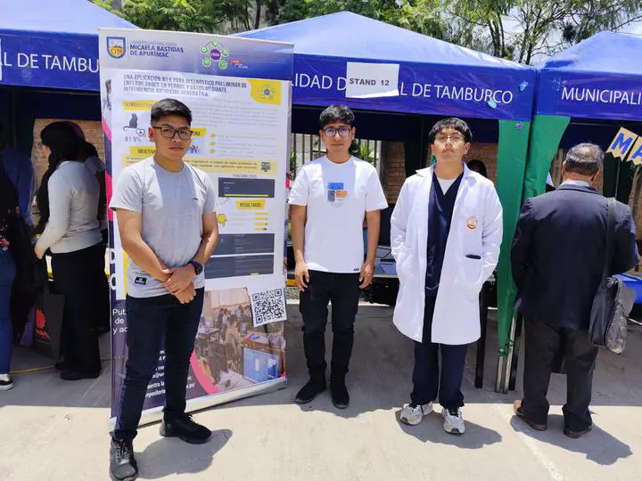

Felicitamos a los estudiantes miembros del grupo de investigación de IA UNAMBA por haber presentado el proyecto de IA en FERCYT 2025.

El proyecto denominado Una Aplicación Web para Diagnostico Preliminar de Enfermedades en perros y gatos mediante Inteligencia Artificial Generativa fue presentado por los Estudiantes Keytel, Aron y Brandon, como asesor participó el prof. Yonatan. Este trabajo tiene como resumen:

La relación entre las personas y sus mascotas domésticas ha adquirido una relación más amena, donde los animales no solo son considerados compañeros, sino también miembros del entorno familiar. El presente trabajo tiene como objetivo diagnosticar el estado de salud de la mascota del perro o gato mediante una aplicación web utilizando modelos de inteligencia artificial generativos, facilitando la atención temprana y mejorando la comunicación entre propietarios y servicios veterinarios. La metodología se basó en un enfoque tecnológico-aplicativo, utilizando una arquitectura Model Repository Controller (MRC). El front-end fue desarrollado con Next.js, Tailwind CSS y Zustand, el backend con C# y MySQL, la aplicación se desplegó en Vercel. Los resultados evidenciaron que el modelo logró identificar afecciones comunes como gastroenteritis, dermatitis y conjuntivitis con alta precisión, siendo valorado por los usuarios como una herramienta accesible y confiable. Se concluye que Floopy constituye un avance innovador en la digitalización del cuidado veterinario, promoviendo la tenencia responsable, la prevención de enfermedades zoonóticas y el uso responsable de la inteligencia artificial en el ámbito de la salud animal.
