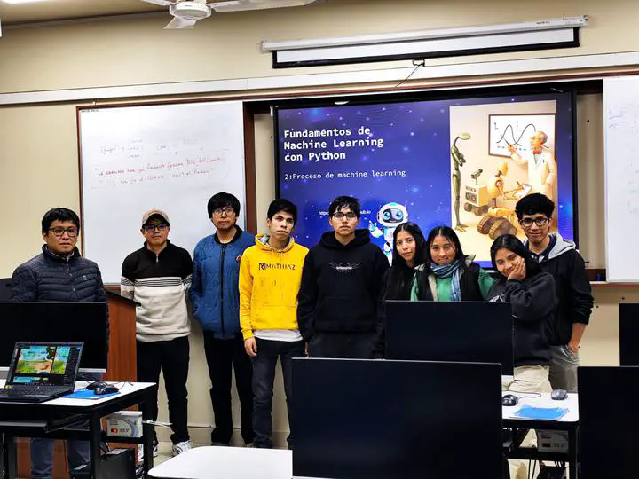

Fortalecer capacidades en fundamentos de Machine Learning con Python.
---

Se realizó curso taller de Fundamentos de Machine Lerning con Python para fortalecer las competencias académicas y de investigación de los estudiantes de la Escuela Profesional de Ingeniería Informática y Sistemas en la aplicación de Python para el diseño, implementación y evaluación de modelos de Machine Learning, mediante una capacitación teórico-práctica que promueva el desarrollo de soluciones inteligentes orientadas a la investigación y la innovación tecnológica.
